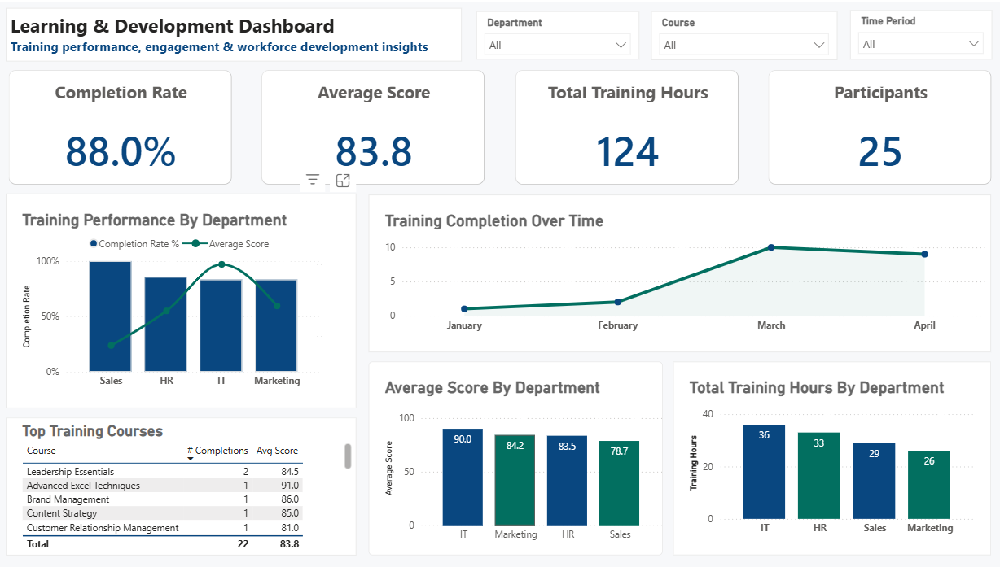
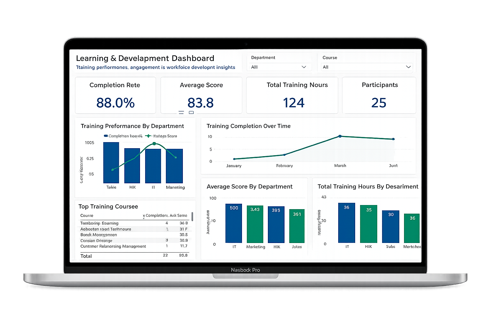

# Learning & Development Dashboard
### Power BI | DAX | HR Analytics | Training Performance

<p align="center">


</p>

## Project Overview

Interactive Learning & Development dashboard designed to analyse employee training performance, completion rates, training hours, engagement, and course outcomes across departments.

This project demonstrates how training data can be transformed into actionable insights that help HR and business leaders monitor learning effectiveness, identify participation gaps, and improve workforce development decisions.

## Business Problem

Organisations often struggle to understand:
- which departments are completing training,
- how training performance varies across teams,
- which courses have stronger engagement,
- and where learning interventions may be needed.

## Dashboard Preview



## Tools Used

- Power BI
- DAX
- Excel / CSV
- Data modelling
- HR analytics
- Dashboard design

## Key Features

- Completion rate tracking
- Average score analysis
- Total training hours
- Department-level performance comparison
- Training completion over time
- Top training courses
- Interactive slicers by department, course, and date

## Data Pipeline

```text
CSV Data → Power BI Data Model → DAX Measures → Interactive L&D Dashboard
```

## Dataset

The project uses three source tables:

- `employees.csv`
- `courses.csv`
- `training_records.csv`

## Dashboard Metrics

- Completion Rate
- Average Score
- Total Training Hours
- Training Participants
- Completed Trainings
- Training Completion Over Time
- Training Performance by Department
- Training Hours by Department
- Top Training Courses

## Key Insights

- Training completion rates varied across departments.
- Higher participation was linked to stronger average course performance.
- Certain departments required additional visibility into incomplete training.
- Training hours were concentrated across a small number of courses.
- Interactive reporting improved visibility into learning outcomes and engagement.

## Repository Structure

```text
learning-development-dashboard/
├── data/
├── dashboard/
├── docs/
├── images/
├── sql/
├── README.md
└── LICENSE

```

## How to Use This Project

1. Upload the CSV files in `data/` to BigQuery.
2. Run the SQL scripts in the `sql/` folder.
3. Connect Power BI to the BigQuery views.
4. Recreate or review the dashboard visuals.
5. Use the DAX measures in `docs/dax_measures.md`.

## Links

🔗 **GitHub Repository**  
https://github.com/smlumpa/Learning-Development-Dashboard

📊 **Live Power BI Dashboard**  
[View Interactive Dashboard](https://app.powerbi.com/view?r=eyJrIjoiYzZjZjExYjAtYzRlYS00NTFhLWFlYmMtYzQwN2QyNTU4NDNjIiwidCI6IjQ1Mzc4OWE0LWM3YjEtNGMzYy04MWUxLWNiNGZmZWZhNDRjMCJ9)

---

## Interactive Dashboard Preview

<p align="center">
  <a href="https://app.powerbi.com/view?r=eyJrIjoiYzZjZjExYjAtYzRlYS00NTFhLWFlYmMtYzQwN2QyNTU4NDNjIiwidCI6IjQ1Mzc4OWE0LWM3YjEtNGMzYy04MWUxLWNiNGZmZWZhNDRjMCJ9">
    
  </a>
</p>

## Author

Sophia Lumpa  
Business Intelligence & Operations Analyst
