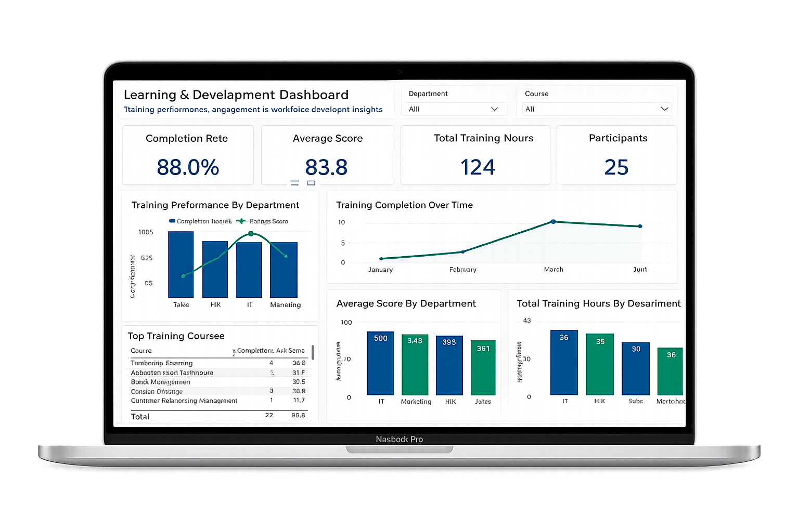
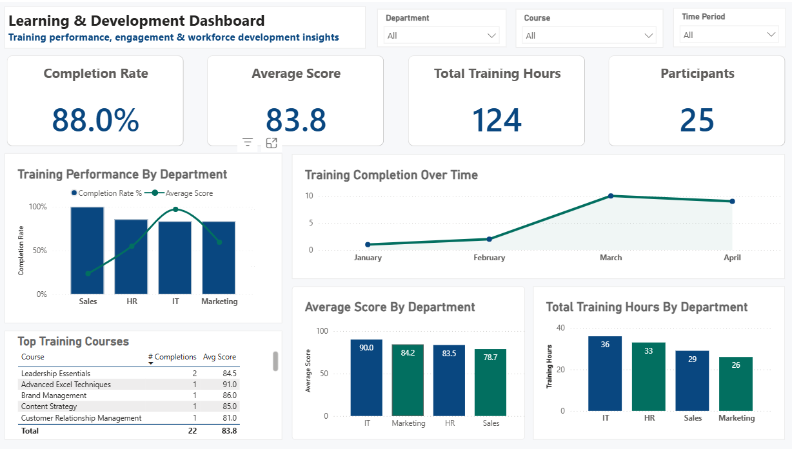

# Learning & Development Dashboard

**Power BI · DAX · BigQuery · SQL · Learning Analytics**

An interactive workforce learning dashboard that analyses course participation,
completion, scores, training hours and costs across departments.

> **Data declaration:** This project uses synthetic sample employee and training
> data. Employee names are fictitious labels, and no confidential employer,
> client or learner information is included.

<p align="center">
  <a href="https://app.powerbi.com/view?r=eyJrIjoiYzZjZjExYjAtYzRlYS00NTFhLWFlYmMtYzQwN2QyNTU4NDNjIiwidCI6IjQ1Mzc4OWE0LWM3YjEtNGMzYy04MWUxLWNiNGZmZWZhNDRjMCJ9">
    
  </a>
</p>

## Business questions

- What proportion of training enrolments are completed?
- Which departments have the strongest completion rates and scores?
- Which courses have high participation but comparatively low completion?
- How are training hours and costs distributed?
- Where may additional learning support or follow-up be useful?

## Verified headline findings

The figures below were reproduced from the repository's three CSV files.

| Metric | Result |
|---|---:|
| Employees represented | 80 |
| Courses | 10 |
| Training records | 359 |
| Completed training records | 226 |
| Overall completion rate | 63.0% |
| Average completed-course score | 80.7 |
| Recorded training hours | 1,126 |
| Total recorded training cost | £89,355.99 |

Sales had the highest departmental completion rate at **66.1%**, while
Marketing had the lowest at **60.0%**. Finance achieved the highest average
score among completed records at **83.8**.

Cybersecurity Awareness had the highest course completion rate at **83.7%**.
Data Protection Training had the lowest at **46.3%**, followed by Power BI
Dashboarding at **51.5%**. These findings are descriptive results from synthetic
data and are not claims about a real organisation.

## Dashboard preview



## Dashboard features

- Completion-rate tracking
- Average completed-course score
- Total training hours and costs
- Department and course comparisons
- Completion trends over time
- Interactive department, course and date filters

## Data pipeline

```text
Synthetic CSV data → BigQuery views → Power BI model → DAX measures → Dashboard
```

## Data model

- `employees.csv` — employee, department, job level and join date
- `courses.csv` — course, category, provider, mandatory status and duration
- `training_records.csv` — enrolment status, scores, hours, feedback and costs

The three tables form a simple star-style model:

```text
Employees (1) ─── (*) Training Records (*) ─── (1) Courses
```

See [the data dictionary](docs/data_dictionary.md) and
[validation report](docs/validation_report.md).

## Repository structure

```text
├── dashboard/
│   └── L&D dashboard.pbix
├── data/
│   ├── employees.csv
│   ├── courses.csv
│   ├── training_records.csv
│   └── learning_development_dataset.xlsx
├── docs/
│   ├── dax_measures.md
│   ├── data_dictionary.md
│   └── validation_report.md
├── images/
├── sql/
│   ├── 01_create_training_records_view.sql
│   ├── 02_create_training_metrics_view.sql
│   └── 03_sql_showcase.sql
├── .gitignore
├── LICENSE
└── README.md
```

## Reproduce the analysis

1. Review the source tables in `data/`.
2. Upload the three CSV files to a BigQuery dataset.
3. Replace `your-project` in the SQL scripts with your Google Cloud project ID.
4. Run the scripts in numerical order.
5. Connect Power BI to the resulting tables or views.
6. Create the relationships shown above.
7. Add the documented measures from `docs/dax_measures.md`.
8. Compare the results with `docs/validation_report.md`.

## Dashboard access

[Open the interactive Power BI dashboard](https://app.powerbi.com/view?r=eyJrIjoiYzZjZjExYjAtYzRlYS00NTFhLWFlYmMtYzQwN2QyNTU4NDNjIiwidCI6IjQ1Mzc4OWE0LWM3YjEtNGMzYy04MWUxLWNiNGZmZWZhNDRjMCJ9)

## Author

**Sophia Lumpa**  
Business Intelligence & Operations Analyst  
[Portfolio](https://www.virtavis.com/) · [GitHub](https://github.com/smlumpa)
