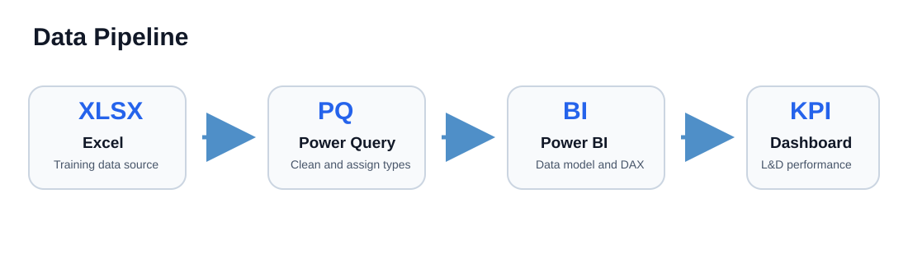

# Learning & Development Dashboard

**Power BI · Power Query · DAX · Excel · Learning Analytics**

An interactive workforce learning dashboard for monitoring training completion, scores, completed training hours and participation across departments and courses.

<p align="center">
  <a href="https://app.powerbi.com/view?r=eyJrIjoiYzZjZjExYjAtYzRlYS00NTFhLWFlYmMtYzQwN2QyNTU4NDNjIiwidCI6IjQ1Mzc4OWE0LWM3YjEtNGMzYy04MWUxLWNiNGZmZWZhNDRjMCJ9">
    
  </a>
</p>

## Verified dashboard metrics

These figures were verified against the Power BI model exported on 24 September 2026.

| Metric | Result |
|---|---:|
| Training records | 25 |
| Participants | 25 |
| Completed trainings | 22 |
| Completion rate | 88.0% |
| Average score for completed training | 83.8 |
| Completed training hours | 124 |
| Departments | 4 |
| Distinct course names | 24 |

The figures describe the portfolio dashboard dataset and should not be interpreted as results from a named organisation.

## Business questions

- What proportion of training records are completed?
- How do completion rates vary by department?
- Which courses show lower completion or engagement?
- How do completed training hours vary across departments?
- Where could learning support or follow-up be prioritised?

## Dashboard preview


## Dashboard features

- Completion-rate tracking
- Average score for completed training
- Completed training hours
- Participant count
- Department and course comparisons
- Completion trends over time
- Department, course and time-period filters

## Data pipeline



```text
Excel source → Power Query preparation → Power BI model → DAX measures → Interactive dashboard
```

The project did not use SQL or BigQuery.

## Technical approach

The model imports an Excel worksheet named `Training data` into a single Power BI table called `Training_data`. Power Query promotes the headers and assigns appropriate text, date and whole-number data types.

DAX measures calculate completion rate, average completed-training score, completed training hours, completed training count and distinct participants. Power BI's automatically generated local date table supports time-based filtering.

## Model fields

- `Employee_ID`
- `Department`
- `Course_Name`
- `Completion_Status`
- `Completion_Date`
- `Score`
- `Training_Hours`
- `Training_Cost`
- `Feedback_Rating`

See the [verified DAX measures](docs/dax_measures.md) and [model validation report](docs/validation_report.md).

## Repository structure

```text
├── dashboard/
│   └── L&D dashboard.pbix
├── docs/
│   ├── dax_measures.md
│   └── validation_report.md
├── images/
│   ├── dashboard_screenshot.png
│   ├── laptop_mockup.png
│   └── pipeline_diagram.svg
├── .gitignore
├── LICENSE
└── README.md
```

## Dashboard access

[Open the interactive Power BI dashboard](https://app.powerbi.com/view?r=eyJrIjoiYzZjZjExYjAtYzRlYS00NTFhLWFlYmMtYzQwN2QyNTU4NDNjIiwidCI6IjQ1Mzc4OWE0LWM3YjEtNGMzYy04MWUxLWNiNGZmZWZhNDRjMCJ9)

## Author

**Sophia Lumpa**  
Business Intelligence & Operations Analyst  
[Portfolio](https://www.virtavis.com/) · [GitHub](https://github.com/smlumpa)
